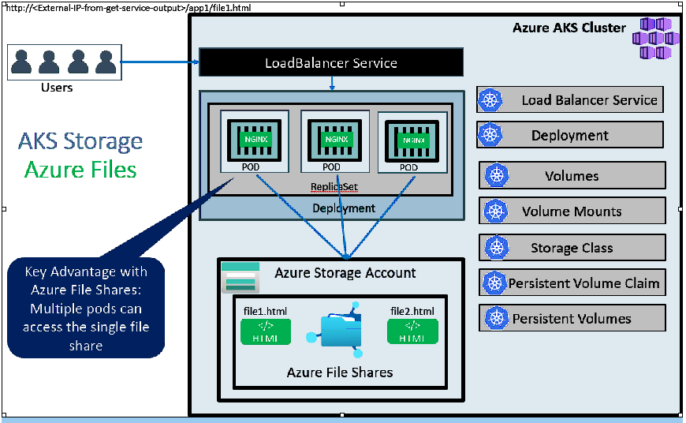
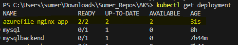
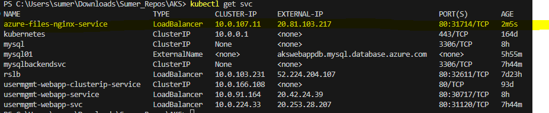
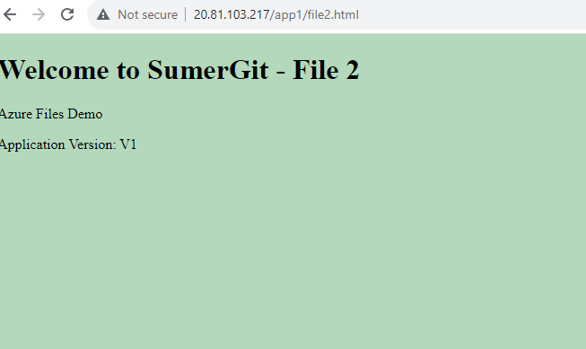

 ##Step-01: Introduction
- Understand Azure Files
- We are going to write a Deployment Manifest for NGINX Application which will have its static content served from **Azure File Shares** in **app1** folder
- We are going to mount the file share to a specific path `mountPath: "/usr/share/nginx/html/app1"` in the Nginx container

### kube-manifests-v2: AKS defined default storage class
- With default AKS created storage classes only below two options are available for us.
  - Standard_LRS - standard locally redundant storage (LRS)
  - Premium_LRS - premium locally redundant storage (LRS)  

- **Important Note:** Azure Files support premium storage in AKS clusters that run Kubernetes 1.13 or higher, minimum premium file share is 100GB


## Step-09: Upload Nginx Files to Azure File Share
- Go to Storage Accounts
- Select and Open storage account under resoure group **mc_aks-rg1_aksdemo1_eastus**
- In **Overview**, go to **File Shares**
- Open File share with name which starts as **kubernetes-dynamic-pv-xxxxxx**
- Click on **Upload** and upload 
  - file1.html 
  - file2.html

## Step-10: Access Application & Test
```
# URLs
http://<External-IP-from-get-service-output>/app1/file1.html
http://<External-IP-from-get-service-output>/app1/file2.html

``````




